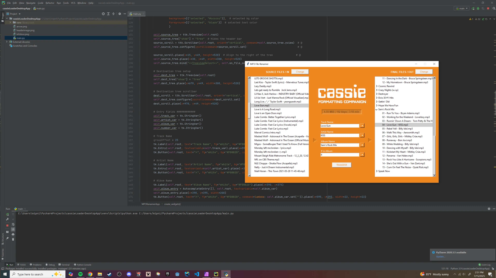

 

 

<h3 align="center">cassie | mp3 cassette player</h3>

Raspberry Pi based mp3 cassette player that gives the nostalgic feel of analog tech. Use the desktop loader companion app to format and upload songs to the pi's storage.
  
 <a href="https://github.com/ssambender/cassie/releases/tag/v1.0.0"><strong>Check it out Online »</strong></a>

___

### Features
- 10+ cassette tape styles
- 8+ menu background styles
- 6+ text colors
- Seek FF and rewind
- Speed adjust setting
- Dispaly artists optional setting
- Autoplay
- Desktop music formatter

Controls:

`1` - Play/Pause/Select

`2` - Rewind/Previous/Up

`3` - Forward/Next/Down

`4` - Back/Home/Settings

---

 

---

### Planned features:
- [ ] Bluetooth compatability
- [ ] SSH/Wireless loading from desktop companion

_Feel free to submit pull requests!_

---

### Known bugs:
- [ ] None

_Please report any bugs you find!_

---

### Libraries used:
- pygame

### Fonts used:
- Data 70

---

 

